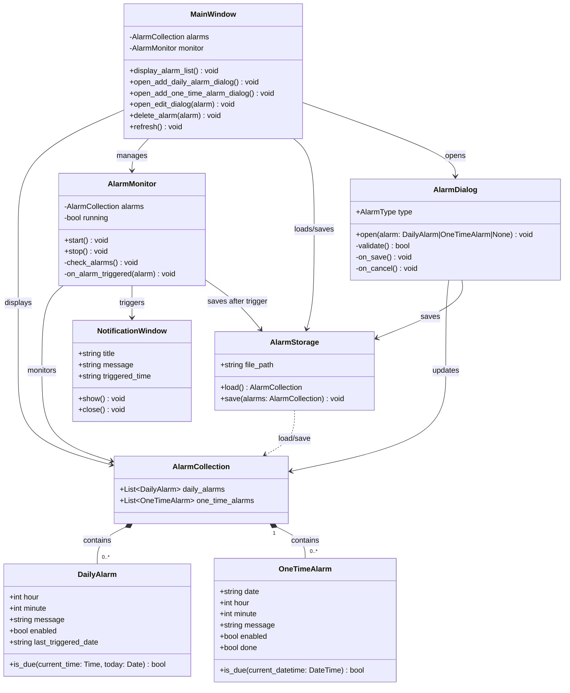

# CLASS.md

## 前提・対象範囲

このファイルは `SPEC.md` に基づく「Win11用 静かなアラーム時計」のクラス設計を示す。  
対象範囲は **Ver 1.0** の必須機能に限定する。  
実装言語は未確定のため（QandA Q1 参照）、このクラス図は言語非依存の論理設計として記述する。  
実装時には選定した言語・フレームワークの慣習に合わせて調整すること。

入力情報: `SPEC.md`（全セクション）、`USECASE.md`、`SEQUENCE.md`

---

## クラス図



---

## クラス詳細

### DailyAlarm

毎日アラームのデータを保持するクラス。

| フィールド | 型 | 説明 |
|-----------|-----|------|
| hour | int | 通知する時（0〜23） |
| minute | int | 通知する分（0〜59） |
| message | str | 通知時に表示するメッセージ |
| enabled | bool | アラームが有効かどうか |
| last_triggered_date | string | 最後に通知した日付（ISO 8601形式: "YYYY-MM-DD"）。未通知の場合は空文字列または null。 |

**メソッド:**  
`is_due(current_time, today)`: 現在時刻が通知条件を満たすかを判定する。  
条件: `enabled == true` かつ `hour:minute == current_time` かつ `last_triggered_date != today`

**注意:** `last_triggered_date` の初期値（null / 空文字列）の扱いは実装時に統一すること。

---

### OneTimeAlarm

単発アラームのデータを保持するクラス。

| フィールド | 型 | 説明 |
|-----------|-----|------|
| date | string | 通知する日付（ISO 8601形式: "YYYY-MM-DD"） |
| hour | int | 通知する時（0〜23） |
| minute | int | 通知する分（0〜59） |
| message | str | 通知時に表示するメッセージ |
| enabled | bool | アラームが有効かどうか |
| done | bool | 通知済みかどうか（通知後に true に更新される） |

**メソッド:**  
`is_due(current_datetime)`: 現在日時が通知条件を満たすかを判定する。  
条件: `enabled == true` かつ `done == false` かつ `date:hour:minute == current_datetime`

---

### AlarmStorage

JSON ファイルへの読み書きを担当するクラス。

| フィールド | 型 | 説明 |
|-----------|-----|------|
| file_path | string | JSONファイルのパス。保存場所は未確定（QandA Q5 参照） |

**メソッド:**

`load() -> AlarmCollection`:  
- JSONファイルを読み込み、AlarmCollection を返す
- ファイルが存在しない場合: 空の AlarmCollection を返す
- ファイルが破損している場合: エラーを通知して空の AlarmCollection を返す（暫定。QandA Q8 参照）

`save(alarms: AlarmCollection)`:  
- AlarmCollection を JSON 形式でファイルに書き込む
- 書き込み失敗時のエラー処理は未確定

**JSONデータ形式（SPEC.md 第8節より）:**
```json
{
  "daily_alarms": [
    {
      "hour": 11,
      "minute": 52,
      "message": "昼飯の時間です",
      "enabled": true,
      "last_triggered_date": "2026-04-14"
    }
  ],
  "one_time_alarms": [
    {
      "date": "2026-04-15",
      "hour": 14,
      "minute": 50,
      "message": "15:00来訪の10分前です",
      "enabled": true,
      "done": false
    }
  ]
}
```

---

### AlarmCollection

毎日アラームと単発アラームのリストをまとめて保持するクラス。

| フィールド | 型 | 説明 |
|-----------|-----|------|
| daily_alarms | List[DailyAlarm] | 毎日アラームのリスト |
| one_time_alarms | List[OneTimeAlarm] | 単発アラームのリスト |

---

### AlarmMonitor

定期的に現在時刻とアラーム設定を照合し、発火条件を満たすアラームを検出するクラス。

| フィールド | 型 | 説明 |
|-----------|-----|------|
| alarms | AlarmCollection | 監視対象のアラームデータ |
| running | bool | 監視が実行中かどうか |

**メソッド:**

`start()`: 定期チェックを開始する。監視間隔は未確定（QandA Q2 参照）。  
`stop()`: 定期チェックを停止する。  
`check_alarms()`: 現在時刻と全アラームを照合し、発火条件を満たすものを処理する。  
`on_alarm_triggered(alarm)`: アラームが発火した際に呼ばれる。データ更新・保存・通知表示を実行する。

**注意:**
- 同時刻に複数のアラームが重なった場合の挙動は未確定（QandA Q3 参照）
- 通知ウィンドウが既に開いている場合の挙動は未確定（QandA Q4 参照）
- アプリ起動前に過ぎた通知は発火させない。起動時の初回チェックで判定する（QandA Q7 参照）

---

### NotificationWindow

通知ポップアップ画面のクラス。

| フィールド | 型 | 説明 |
|-----------|-----|------|
| title | string | 通知ウィンドウのタイトル（例: "通知"） |
| message | string | 通知メッセージ |
| triggered_time | string | 通知発火時刻の文字列（例: "11:52"） |

**メソッド:**

`show()`: 通知ウィンドウを表示する。  
- 最前面表示: SPEC.md では Ver 1.1 の機能として記載されているが、Ver 1.0 での扱いは未確定
- 音は出さない（SPEC.md の基本方針）
- 自動クローズなし（Ver 1.0 では手動クローズのみ。暫定。QandA Q6 参照）

`close()`: ユーザーが「閉じる」ボタンを押した際にウィンドウを閉じる。

---

### MainWindow

メイン画面のクラス。現在時刻表示・アラーム一覧表示・操作ボタンを提供する。

**メソッド:**

`display_alarm_list()`: 登録済みの毎日アラームと単発アラームを一覧表示する。  
表示項目: 種別・日付・時刻・メッセージ・状態（有効/無効/完了）

`open_add_daily_alarm_dialog()`: 毎日アラーム追加ダイアログを開く。  
`open_add_one_time_alarm_dialog()`: 単発アラーム追加ダイアログを開く。  
`open_edit_dialog(alarm)`: 選択したアラームの編集ダイアログを開く。  
`delete_alarm(alarm)`: 選択したアラームを削除する。  
`refresh()`: アラーム一覧を最新データで再描画する。

---

### AlarmDialog

アラームの追加・編集ダイアログのクラス。毎日アラームと単発アラームの両方を扱う。

**メソッド:**

`open(alarm)`: ダイアログを開く。`alarm` が `None` の場合は新規追加、渡された場合は編集。  
`validate()`: 入力値のバリデーションを実行する。不正な場合はエラーメッセージを表示して `false` を返す。  
`on_save()`: 「保存/登録」ボタン押下時の処理。バリデーション後にデータを保存する。  
`on_cancel()`: 「キャンセル」ボタン押下時の処理。変更を破棄してダイアログを閉じる。

**バリデーション項目:**
- 時: 0〜23 の整数
- 分: 0〜59 の整数
- 日付（単発のみ）: 正しい日付形式（YYYY-MM-DD または YYYY/MM/DD）
- メッセージ: 空欄可否は未確定（QandA 追加候補）

---

## 未確定事項サマリー

| クラス | 未確定項目 | 参照 |
|-------|----------|------|
| AlarmStorage | file_path の保存場所 | QandA Q5 |
| AlarmStorage | save 失敗時のエラー処理 | 未記録 |
| AlarmMonitor | 定期チェックの間隔 | QandA Q2 |
| AlarmMonitor | 複数アラーム同時発火の挙動 | QandA Q3 |
| AlarmMonitor | 通知ウィンドウ表示中の2回目発火 | QandA Q4 |
| NotificationWindow | 最前面表示の実装可否（Ver 1.0 or 1.1） | QandA 追加候補 |
| NotificationWindow | 自動クローズの有無 | QandA Q6 |
| AlarmDialog | メッセージ空欄時の許可/拒否 | QandA 追加候補 |
| DailyAlarm | last_triggered_date の初期値の型（null vs 空文字列） | 実装時に統一が必要 |
