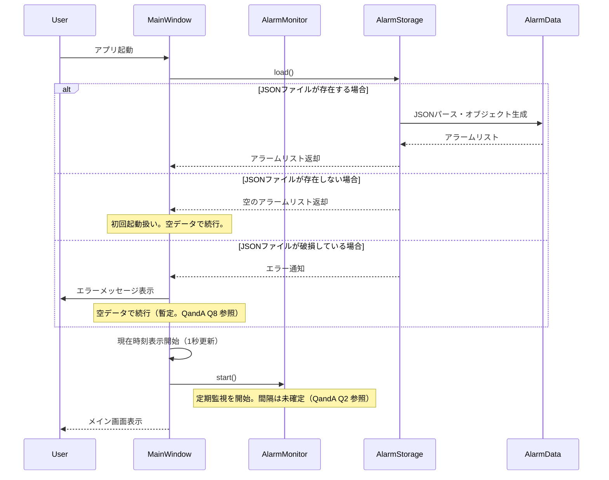
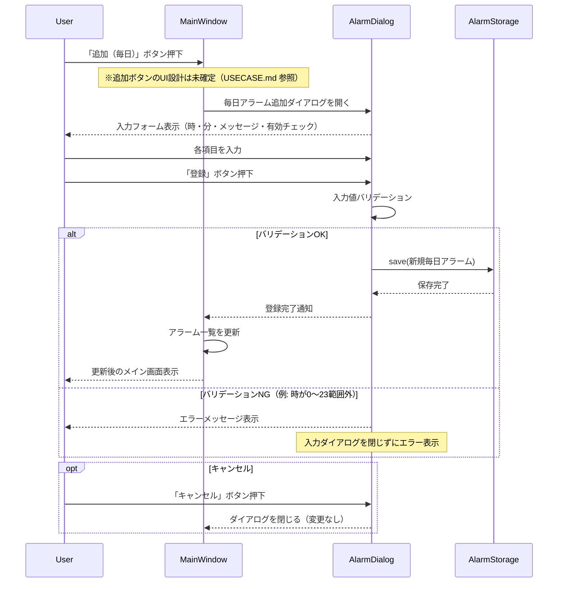
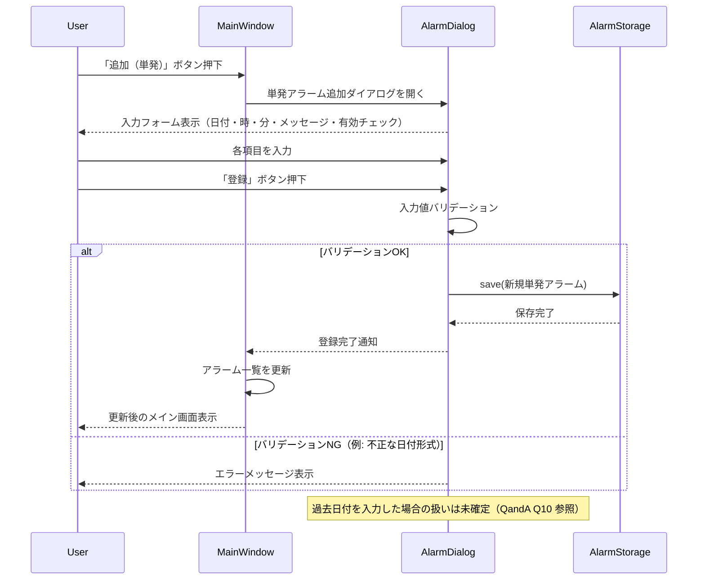
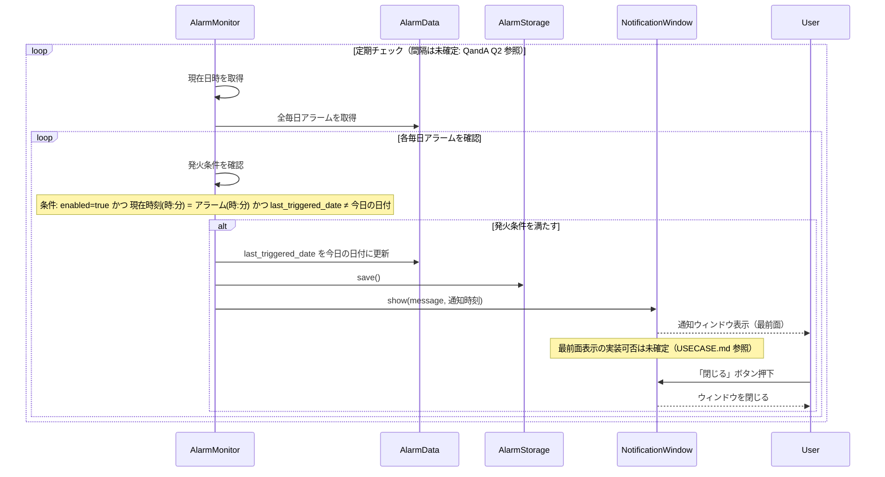
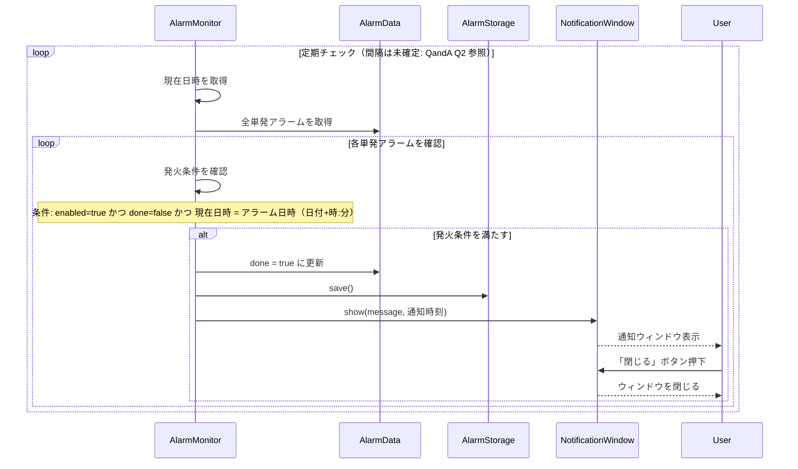
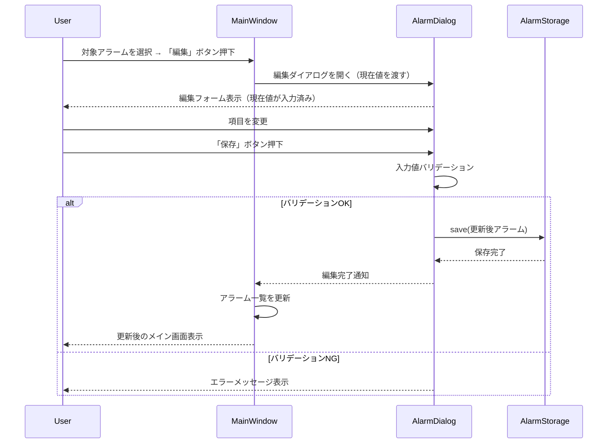
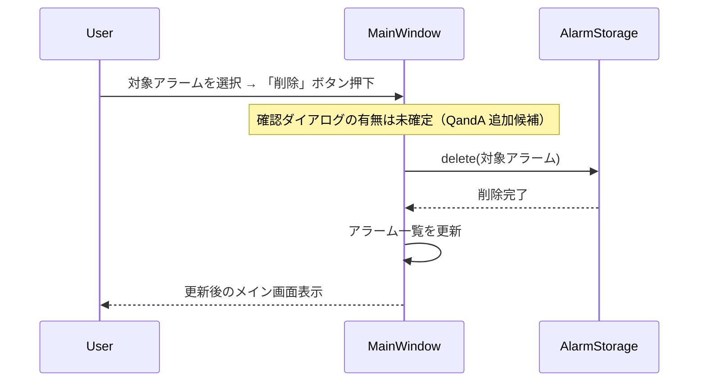

# SEQUENCE.md

## 前提・対象範囲

このファイルは `SPEC.md` に基づく「Win11用 静かなアラーム時計」の主要シーケンス図を示す。  
対象範囲は **Ver 1.0** の必須機能に限定する。  
未確定事項は `QandA.md` を参照。

入力情報: `SPEC.md`（全セクション）、`USECASE.md`

---

## 登場コンポーネント

| コンポーネント | 役割 |
|-------------|------|
| User | アプリを操作するユーザー |
| MainWindow | メイン画面（現在時刻・アラーム一覧表示） |
| AlarmDialog | アラーム追加・編集ダイアログ |
| AlarmMonitor | 定期的に時刻チェックを行うタイマー機構 |
| NotificationWindow | 通知ポップアップ画面 |
| AlarmStorage | JSONファイルへの読み書きを担当するモジュール |
| AlarmData | アラームのデータ（毎日/単発） |

---

## SEQ-01: アプリ起動シーケンス

---

## SEQ-02: 毎日アラーム登録シーケンス

---

## SEQ-03: 単発アラーム登録シーケンス

---

## SEQ-04: 毎日アラームの通知シーケンス

---

## SEQ-05: 単発アラームの通知シーケンス

---

## SEQ-06: アラーム編集シーケンス

---

## SEQ-07: アラーム削除シーケンス

---

## 未確定事項サマリー

| シーケンス | 未確定項目 | 参照 |
|---------|----------|------|
| SEQ-01 | JSONファイル破損時の挙動 | QandA Q8 |
| SEQ-01 | 起動前に過ぎた単発アラームの done フラグ更新の有無 | QandA Q7 |
| SEQ-02/03 | 追加ボタンのUI設計（1ボタン種別選択 vs 2ボタン） | USECASE.md |
| SEQ-04/05 | 監視間隔（1秒 or 5秒） | QandA Q2 |
| SEQ-04/05 | 複数アラーム同時発火の扱い | QandA Q3 |
| SEQ-04/05 | 通知ウィンドウが既に開いている場合の挙動 | QandA Q4 |
| SEQ-04 | 最前面表示の実装可否（Ver 1.0 or 1.1） | QandA 追加候補 |
| SEQ-07 | 削除確認ダイアログの有無 | QandA 追加候補 |
