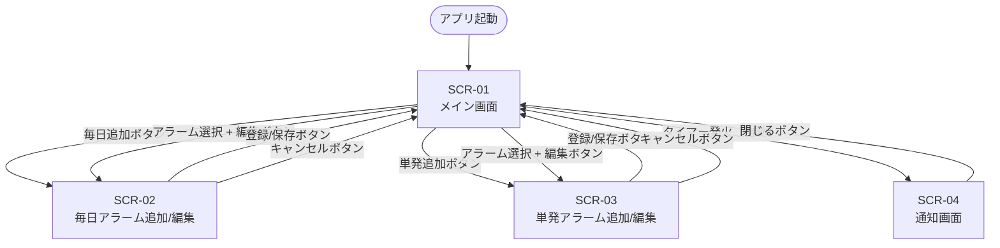

# UI.md

## 前提・対象範囲

このファイルは `SPEC.md` に基づく「Win11用 静かなアラーム時計」の画面設計を示す。  
対象範囲は **Ver 1.0** の必須機能に限定する。  
実装言語・UIフレームワークは未確定のため（QandA Q1 参照）、このファイルは論理的な画面構成と遷移を記述する。  
具体的なフォントサイズ・カラーコード・ピクセル値などは実装フェーズで決定すること。

入力情報: `SPEC.md`（第6節: 画面構成、第7節: 動作仕様）、`USECASE.md`

---

## 画面一覧

| 画面ID | 画面名 | 概要 |
|-------|-------|------|
| SCR-01 | メイン画面 | 現在時刻とアラーム一覧を表示する |
| SCR-02 | 毎日アラーム追加/編集画面 | 毎日アラームの登録・編集を行う |
| SCR-03 | 単発アラーム追加/編集画面 | 単発アラームの登録・編集を行う |
| SCR-04 | 通知画面 | アラーム発火時に表示されるポップアップ |

---

## 画面遷移図



**注意:**  
- SCR-01 からの「編集」遷移先は、選択したアラームの種別（毎日/単発）によって SCR-02 または SCR-03 になる。  
- SCR-04（通知画面）は SCR-01 の表示中に割り込みで表示される。通知画面は独立したウィンドウとして表示される（メイン画面は閉じない）。

---

## SCR-01: メイン画面

### 目的
現在時刻を表示し、登録済みアラームの一覧確認・操作（追加/編集/削除）を行う。

### 表示要素

| 要素 | 説明 |
|-----|------|
| 現在時刻 | リアルタイムで更新される現在日時（表示形式: `YYYY/MM/DD HH:MM:SS`）|
| 毎日アラーム一覧 | 登録済みの毎日アラームを表形式で表示 |
| 単発アラーム一覧 | 登録済みの単発アラームを表形式で表示 |
| 追加ボタン（毎日） | 毎日アラーム追加画面を開く |
| 追加ボタン（単発） | 単発アラーム追加画面を開く |
| 編集ボタン | 選択したアラームの編集画面を開く |
| 削除ボタン | 選択したアラームを削除する |

**未確定: 追加ボタンのUI設計**  
「追加（毎日）」「追加（単発）」を別ボタンにするか、1つの「追加」ボタンを押した後に種別を選ぶかは未定。  
`QandA.md` に追加候補。

### 一覧表示項目

**毎日アラーム一覧:**

| 列 | 内容 |
|----|------|
| 種別 | 「毎日」固定 |
| 時刻 | `HH:MM` 形式 |
| メッセージ | 登録したメッセージ |
| 状態 | 「有効」または「無効」 |

**単発アラーム一覧:**

| 列 | 内容 |
|----|------|
| 種別 | 「単発」固定 |
| 日付 | `YYYY/MM/DD` 形式 |
| 時刻 | `HH:MM` 形式 |
| メッセージ | 登録したメッセージ |
| 状態 | 「有効」「無効」「完了」のいずれか |

### 削除動作の注意
削除確認ダイアログの有無は未確定（QandA 追加候補）。  
暫定: 削除ボタン押下後、確認なしで即削除（後で変更可能）。

### レイアウトイメージ（ASCII）

```
+----------------------------------------------+
| 現在時刻: 2026/04/15 11:48:20                 |
+----------------------------------------------+
| [毎日アラーム]          [追加（毎日）]          |
| +----+---------+-------+------+              |
| |種別 | 時刻    | メッセージ | 状態 |           |
| +----+---------+-------+------+              |
| |毎日 | 11:52  | 昼飯の時間 | 有効 |  ←選択行  |
| +----+---------+-------+------+              |
|                    [編集]  [削除]             |
+----------------------------------------------+
| [単発アラーム]          [追加（単発）]          |
| +----+----------+---------+-------+------+   |
| |種別 | 日付     | 時刻    |メッセージ|状態 |   |
| +----+----------+---------+-------+------+   |
| |単発|2026/04/15| 14:50  |来訪10分前|有効 |   |
| +----+----------+---------+-------+------+   |
|                    [編集]  [削除]             |
+----------------------------------------------+
```

---

## SCR-02: 毎日アラーム追加/編集画面

### 目的
毎日アラームの新規登録、または既存アラームの内容を編集する。  
新規追加と編集は同一画面（ダイアログ）を使い回す。追加時は空欄、編集時は現在値が入力済み状態で表示する。

### 入力要素

| 要素 | 入力型 | 説明 | バリデーション |
|-----|-------|------|------------|
| 時 | 数値入力 | 0〜23 | 範囲外の場合エラー |
| 分 | 数値入力 | 0〜59 | 範囲外の場合エラー |
| メッセージ | テキスト入力 | 任意のメッセージ | 空欄可否未確定（QandA 追加候補） |
| 有効チェック | チェックボックス | 初期値: チェック済み（有効） | なし |

### ボタン

| ボタン名 | 動作 |
|---------|-----|
| 登録（新規追加時） / 保存（編集時） | バリデーション後に保存してメイン画面に戻る |
| キャンセル | 変更を破棄してメイン画面に戻る |

### レイアウトイメージ（ASCII）

```
+---------------------------+
| 毎日アラーム追加           |
+---------------------------+
| 時  [ 11 ]  分  [ 52 ]    |
| メッセージ: [昼飯の時間です] |
| [v] 有効                  |
|                           |
|  [登録]      [キャンセル]  |
+---------------------------+
```

---

## SCR-03: 単発アラーム追加/編集画面

### 目的
単発アラームの新規登録、または既存アラームの内容を編集する。  
新規追加と編集は同一画面（ダイアログ）を使い回す。

### 入力要素

| 要素 | 入力型 | 説明 | バリデーション |
|-----|-------|------|------------|
| 日付 | 日付入力 | 形式: YYYY/MM/DD または日付ピッカー | 不正形式の場合エラー。過去日付の扱いは未確定（QandA Q10 参照）|
| 時 | 数値入力 | 0〜23 | 範囲外の場合エラー |
| 分 | 数値入力 | 0〜59 | 範囲外の場合エラー |
| メッセージ | テキスト入力 | 任意のメッセージ | 空欄可否未確定（QandA 追加候補） |
| 有効チェック | チェックボックス | 初期値: チェック済み（有効） | なし |

### ボタン

| ボタン名 | 動作 |
|---------|-----|
| 登録（新規追加時） / 保存（編集時） | バリデーション後に保存してメイン画面に戻る |
| キャンセル | 変更を破棄してメイン画面に戻る |

### レイアウトイメージ（ASCII）

```
+-------------------------------+
| 単発アラーム追加               |
+-------------------------------+
| 日付: [ 2026/04/15 ]          |
| 時  [ 14 ]  分  [ 50 ]        |
| メッセージ: [15:00来訪の10分前] |
| [v] 有効                      |
|                               |
|  [登録]        [キャンセル]    |
+-------------------------------+
```

---

## SCR-04: 通知画面

### 目的
アラームの発火時刻になると自動表示される通知ポップアップ。  
ユーザーが内容を確認し、「閉じる」ボタンで手動で閉じる。

### 表示要素

| 要素 | 内容 |
|-----|------|
| タイトル | 「通知」固定（または OS のウィンドウタイトル） |
| メッセージ | 登録したアラームメッセージ |
| 通知時刻 | 通知発火時の時刻（`HH:MM` 形式） |
| 閉じるボタン | ウィンドウを閉じる |

### 動作仕様

| 項目 | 仕様 |
|-----|-----|
| 音 | 出さない（SPEC.md 基本方針） |
| 自動クローズ | なし（Ver 1.0 では手動クローズのみ。暫定。QandA Q6 参照） |
| 最前面表示 | SPEC.md では Ver 1.1 の機能として記載。Ver 1.0 での実装可否は未確定 |

### レイアウトイメージ（ASCII）

```
+-------------------+
| 通知               |
+-------------------+
| 昼飯の時間です      |
|                   |
| 11:52             |
|                   |
|      [閉じる]      |
+-------------------+
```

---

## 未確定事項サマリー

| 画面 | 未確定項目 | 参照 |
|-----|----------|------|
| SCR-01 | 追加ボタンのUI設計（1ボタン vs 2ボタン） | QandA 追加候補 |
| SCR-01 | 削除確認ダイアログの有無 | QandA 追加候補 |
| SCR-02/03 | メッセージ空欄の許可/拒否 | QandA 追加候補 |
| SCR-03 | 過去日付を入力した場合の扱い | QandA Q10 |
| SCR-04 | 最前面表示の実装可否（Ver 1.0 or 1.1） | QandA 追加候補 |
| SCR-04 | 自動クローズの有無・秒数 | QandA Q6 |
| 全画面 | ウィンドウサイズ・フォント・カラー等の詳細デザイン | 実装フェーズで決定 |
