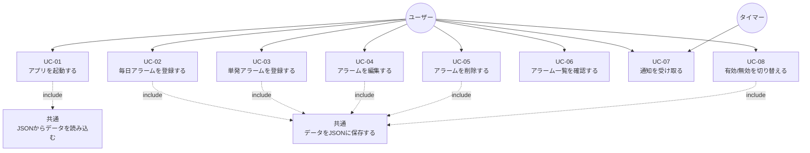

# USECASE.md

## 前提・対象範囲

このファイルは `SPEC.md` に基づく「Win11用 静かなアラーム時計」のユースケース図と説明を示す。  
対象範囲は **Ver 1.0** の必須機能に限定する。  
Ver 1.1 機能（予定時刻からの逆算登録・タスクトレイ常駐）はこのファイルの対象外。

入力情報: `SPEC.md`（全セクション）  
未確定事項: `QandA.md` を参照

---

## アクター定義

| アクター | 説明 |
|---------|------|
| ユーザー | アプリを操作する人。Windows 11 上でアプリを起動・設定・確認する。 |
| タイマー | アプリ内部の定期実行機構。一定間隔で現在時刻とアラーム設定を照合する。（監視間隔は未確定: QandA Q2 参照）|

---

## ユースケース一覧

### UC-01: アプリを起動する
**アクター:** ユーザー  
**概要:** アプリを起動し、保存済みのアラーム一覧と現在時刻を確認する。

### UC-02: 毎日アラームを登録する
**アクター:** ユーザー  
**概要:** 毎日同じ時刻に通知するアラームを新規登録する。登録項目は「時・分・メッセージ・有効/無効」。

### UC-03: 単発アラームを登録する
**アクター:** ユーザー  
**概要:** 特定の日付と時刻に1回だけ通知するアラームを新規登録する。登録項目は「日付・時・分・メッセージ・有効/無効」。

### UC-04: アラームを編集する
**アクター:** ユーザー  
**概要:** 登録済みの毎日アラームまたは単発アラームの内容（時刻・メッセージ・有効/無効）を変更する。

### UC-05: アラームを削除する
**アクター:** ユーザー  
**概要:** 登録済みのアラームを一覧から削除する。削除後はデータファイルからも除去される。

### UC-06: アラーム一覧を確認する
**アクター:** ユーザー  
**概要:** 登録済みの毎日アラームおよび単発アラームをメイン画面で一覧表示する。各アラームの種別・日付・時刻・メッセージ・状態（有効/無効/完了）を確認できる。

### UC-07: 通知を受け取る
**アクター:** タイマー（自動発火）・ユーザー（通知を閉じる）  
**概要:** 指定時刻になるとタイマーが検出し、通知ウィンドウを表示する。ユーザーは内容を確認して「閉じる」ボタンで通知を閉じる。

### UC-08: アラームの有効/無効を切り替える
**アクター:** ユーザー  
**概要:** 登録済みアラームを削除せずに無効化する、または無効アラームを再び有効化する。

---

## ユースケース図

---

## 各ユースケースの詳細

### UC-01: アプリを起動する

**事前条件:** Windows 11 上でアプリの実行ファイルが利用可能であること

**主成功シナリオ:**
1. ユーザーがアプリを起動する
2. システムが JSON ファイルからアラームデータを読み込む
3. メイン画面が表示され、現在時刻とアラーム一覧が表示される
4. タイマーが起動し、定期的な時刻監視が開始される

**例外シナリオ:**
- JSON ファイルが存在しない場合: 空のデータで起動する（QandA Q8 参照）
- JSON ファイルが破損している場合: エラーメッセージを表示し、空のデータで起動する（QandA Q8 参照・暫定）

---

### UC-02: 毎日アラームを登録する

**事前条件:** アプリが起動していること

**主成功シナリオ:**
1. ユーザーがメイン画面の「追加」ボタンを押す
2. 毎日アラーム追加画面が表示される
3. ユーザーが「時・分・メッセージ・有効チェック」を入力する
4. ユーザーが「登録」ボタンを押す
5. 入力内容が検証される
6. アラームが登録され、JSON ファイルに保存される
7. メイン画面のアラーム一覧が更新される

**例外シナリオ:**
- 入力値が不正（時: 0〜23 範囲外、分: 0〜59 範囲外）の場合: エラーメッセージを表示して入力画面に留まる
- メッセージが空の場合の扱い: 未確定（QandA に追加候補）
- キャンセルボタン押下: 登録をキャンセルし、メイン画面に戻る

---

### UC-03: 単発アラームを登録する

**事前条件:** アプリが起動していること

**主成功シナリオ:**
1. ユーザーがメイン画面の「追加」ボタンを押す
2. 単発アラーム追加画面が表示される
3. ユーザーが「日付・時・分・メッセージ・有効チェック」を入力する
4. ユーザーが「登録」ボタンを押す
5. 入力内容が検証される
6. アラームが登録され、JSON ファイルに保存される
7. メイン画面のアラーム一覧が更新される

**例外シナリオ:**
- 過去の日付・時刻が入力された場合の扱い: 未確定（QandA Q10 参照）
- 日付形式が不正の場合: エラーメッセージを表示して入力画面に留まる

---

### UC-04: アラームを編集する

**事前条件:** アプリが起動しており、編集対象のアラームが登録されていること

**主成功シナリオ:**
1. ユーザーが一覧から対象アラームを選択し、「編集」ボタンを押す
2. 編集画面が表示され、現在の設定値が入力欄に表示される
3. ユーザーが変更する項目を編集する
4. ユーザーが「保存」ボタンを押す
5. 変更内容が検証される
6. 変更が保存され、JSON ファイルが更新される
7. メイン画面のアラーム一覧が更新される

---

### UC-05: アラームを削除する

**事前条件:** アプリが起動しており、削除対象のアラームが登録されていること

**主成功シナリオ:**
1. ユーザーが一覧から対象アラームを選択し、「削除」ボタンを押す
2. 確認ダイアログが表示される（※確認ダイアログの有無は未確定）
3. ユーザーが削除を確認する
4. アラームが一覧から削除され、JSON ファイルが更新される

---

### UC-07: 通知を受け取る

**事前条件:** アプリが起動しており、発火条件を満たすアラームが存在すること

**主成功シナリオ（毎日アラーム）:**
1. タイマーが現在時刻とアラーム設定を照合する
2. 有効な毎日アラームで、指定時刻と一致し、当日まだ通知していない場合に発火
3. 通知ウィンドウが最前面に表示される（※最前面表示は Ver 1.1 機能だが、Ver 1.0 での扱い未確定）
4. `last_triggered_date` が当日日付に更新される
5. JSON ファイルが保存される
6. ユーザーが「閉じる」ボタンを押して通知を閉じる

**主成功シナリオ（単発アラーム）:**
1. タイマーが現在時刻とアラーム設定を照合する
2. 有効な単発アラームで、指定日付・時刻と一致し、`done = false` の場合に発火
3. 通知ウィンドウが表示される
4. `done = true` に更新される
5. JSON ファイルが保存される
6. ユーザーが「閉じる」ボタンを押して通知を閉じる

**例外シナリオ:**
- 起動前に時刻が過ぎていた場合: 通知しない（QandA Q7 参照）
- 同時刻に複数のアラームが重なった場合: 未確定（QandA Q3 参照）
- 通知ウィンドウが既に表示中の場合: 未確定（QandA Q4 参照）

---

## 未確定事項サマリー

| 項目 | 詳細 | 参照 |
|-----|------|------|
| 毎日/単発の追加UI の切り分け | 1つの「追加」ボタンから種別を選ぶか、別々のボタンか未定 | UI.md で検討 |
| 削除確認ダイアログの有無 | SPEC に明記なし | QandA 追加候補 |
| メッセージ空欄時の許可/拒否 | SPEC に明記なし | QandA 追加候補 |
| 最前面表示が Ver 1.0 に含まれるか | SPEC の Ver 1.1 機能だが、SPEC 6-4 節にも記述あり | QandA 追加候補 |
